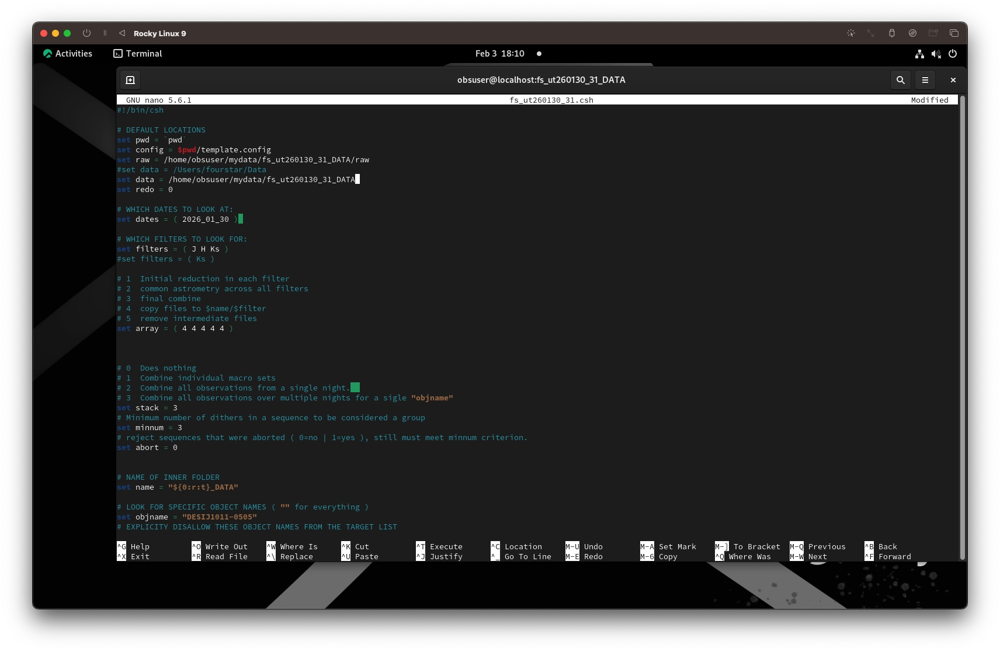
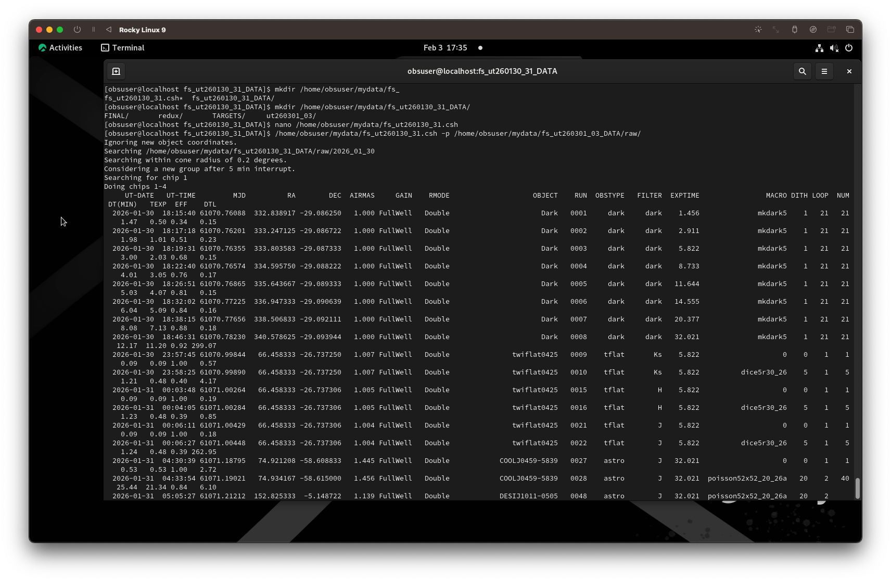

# FSRED

Here are instructions on running the FourStar reduction pipeline **FSRED** on the virtual machine (VM) via the Observing Mac.

## Step 1

Copy the template.csh and template.config files from the `/home/obsuser/FSRED/` directory to your `/home/observer/mydata/` directory. Change the script to reflect the data path, dates, and filters of your data set.

You can rename the scripts if you want -- but DO NOT edit anything inside the `/home/obsuser/FSRED/` directory.

See here for a sample .csh file:



## Step 2

The script that you just configured is calling several executables in the `/home/obsuser/FSRED/bin/` directory. Therefore, change every occurrence in your .csh script of `fsgroup` and `fsred` to `/home/obsuser/FSRED/bin/fsgroup` `/home/obsuser/FSRED/bin/fsred`.

**Troubleshooting:**

- I found that editing with `vi` does not work. Editing with `nano` does work well. When replacing all occurrences of `fsred` and `fsgroup`, use `^\` to do the replacement efficiently.

## Step 3

Now run the pipeline by executing your configured script. For example:

```tcsh
/home/obsuser/mydata/fs_ut260130_31.csh -p /home/obsuser/mydata/fs_ut260130_31_DATA/raw/
```

This is what it should look like when the pipeline has started running:

