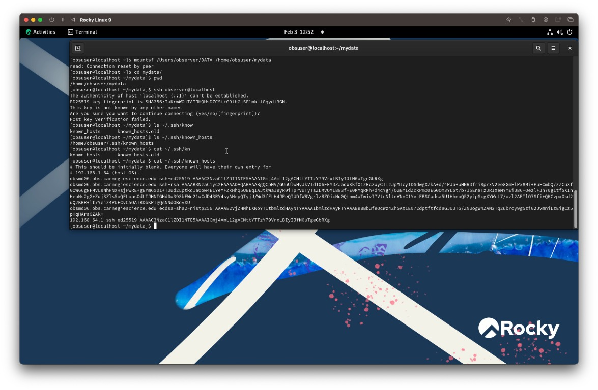
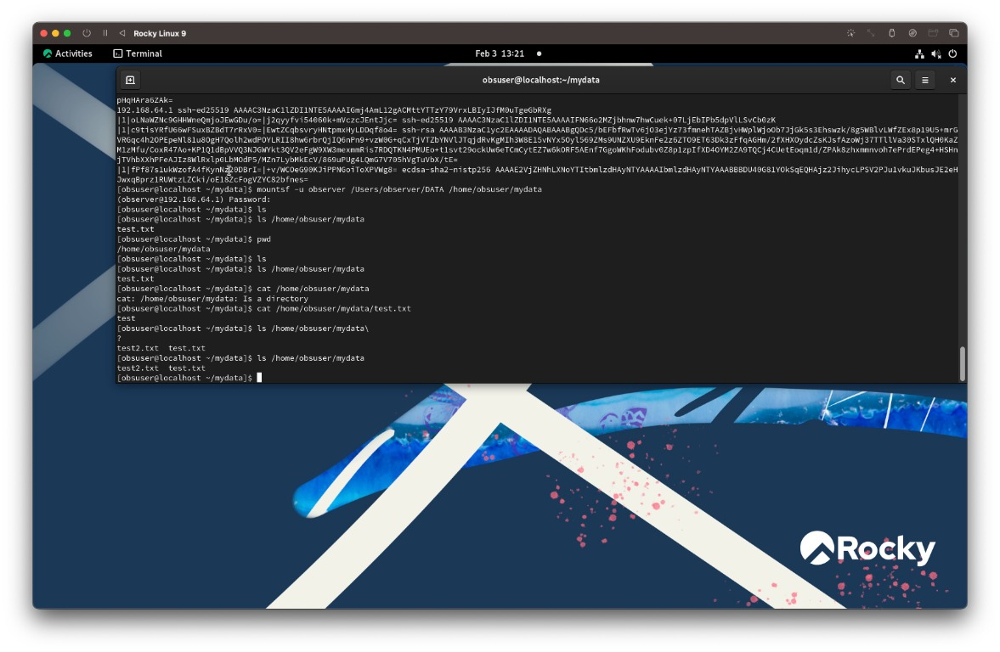

# Setting Up SSH and Mounting Directories from Host to Virtual Machine

## Overview
This document describes how to mount directories from the host computer (Observing Mac) into the virtual machine (VM) using sshfs, allowing the VM to access files on the host without copying them into the limited VM disk space.

## Connection Guide (Steps Completed)

**Note:** If you have previously established a successful SSH connection between the Observing Mac and the VM, you can skip directly to **Step 7** to remount the directory.

### 1. Enable SSH on Observing Mac
SSH needs to be enabled on Observing Mac to allow the VM to connect to it.

**On Observing Mac, run:**
```bash
sudo systemsetup -setremotelogin on
```

If you get a "Full Disk Access" error, enable it through System Settings:
1. Go to **System Settings > General > Sharing**
2. Turn on **Remote Login**

### 2. Find Observing Mac's IP Address
The VM needs to connect to Observing Mac using its IP address.

**On Observing Mac, run:**
```bash
ifconfig | grep "inet " | grep -v 127.0.0.1
```

This returns the network IP address (not 127.0.0.1). For example: `192.168.1.100`

### 3. Add Observing Mac's Host Key to VM's Known Hosts
Before sshfs can mount, the VM needs to know Observing Mac's SSH host key.

**From inside the VM, run:**
```bash
ssh-keyscan -H <observing-mac-ip-address> >> ~/.ssh/known_hosts
```

Replace `<observing-mac-ip-address>` with the IP from step 2 (e.g., `192.168.1.100`).

This appends all SSH key types (ssh-rsa, ecdsa-sha2-nistp256, ssh-ed25519) to the known_hosts file.

### 4. Mount Directory Using sshfs
Now you can mount a directory from Observing Mac into the VM.

**From inside the VM, run:**
```bash
mountsf -u observer /Users/observer/DATA /home/obsuser/mydata
```

This mounts Observing Mac's `/Users/observer/DATA` directory to the VM's `/home/obsuser/mydata` directory.

When prompted for a password, enter **Observing Mac's password** (the password for the `observer` user on Observing Mac).

### 5. Verify the Mount
Check that the mount was successful:

**From inside the VM, run:**
```bash
ls /home/obsuser/mydata
```

You should see the contents of Observing Mac's `/Users/observer/DATA` directory.

### 6. Unmount When Done
To disconnect the mounted directory:

**From inside the VM, run:**
```bash
umount /home/obsuser/mydata
```

### 7. Remount After Unmounting
If you unmount the directory and want to mount it again later, simply run the same command:

**From inside the VM, run:**
```bash
mountsf -u observer /Users/observer/DATA /home/obsuser/mydata
```

You'll be prompted for Observing Mac's password again. The mount point directory (`/home/obsuser/mydata`) must still exist - if it doesn't, create it with `mkdir -p /home/obsuser/mydata`.

## Troubleshooting

- **"Connection reset by user"**: SSH connection failed. Verify SSH is enabled on Observing Mac and the correct IP address is being used.
- **"Name or service not known"**: Hostname couldn't be resolved. Use IP address instead of hostname (astroobs.local didn't work, so use the IP).
- **Permission denied**: Check that you're using the correct username (`-u observer`).
- **Files created on VM don't appear in the mounted directory**: When creating files on the VM, you must use the full path to the mounted directory. For example, instead of `echo "test" > test.txt`, use `echo "test" > /home/obsuser/mydata/test.txt`. You can verify the mount is working correctly by running `ls /home/obsuser/mydata` and checking that the files match those on the Observing Mac's `/Users/observer/DATA` directory.

## Sample Screenshots of Virtual Machine Connection





